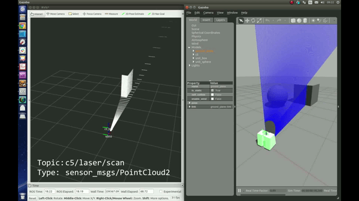

# LEICA SCANSTATION C5 #

This repo contains source code to develop a simulator in Gazebo for Leica Scanstation C5.
This is involved in a ROSIN project.

## Set up ##

* Clone

        mkdir -p ~/catkin_ws/src
        cd ~/catkin_ws/src
        git clone https://github.com/fada-catec/leica_gazebo_simulation.git

* Install dependencies 

* Compile

        cd ~/catkin_ws
        catkin_make
        source devel/setup.bash

## Usage ##

Generate default world and place the device at your convenience

    roslaunch leica_gazebo_simulation c5_system_spawn.launch world:=assembly_line

    roslaunch leica_gazebo_simulation c5_init.launch namespace:=c5

    rosservice call /c5/scan "{file_name: 'scan_sim', vertical_res: 512, horizontal_res: 1024, pan_center: 0.0, tilt_center: 0.0, width: 2, height: 2}"

## Dependencies ##

* ROS [Kinetic](http://wiki.ros.org/kinetic/Installation/Ubuntu)

* PCL:

    1. Boost, Flann, Eigen3

            sudo apt-get install libboost1.58* libflann1.8 libeigen3-dev

    2. PCL-ROS y PCL-CONVERSIONS

            sudo apt-get install ros-kinetic-pcl-*

* Leica packages:

    1. [leica_scanstation_msgs](https://github.com/fada-catec/leica_scanstation/tree/master/leica_scanstation_msgs)

    2. [leica_scanstation_utils](https://github.com/fada-catec/leica_scanstation/tree/master/leica_scanstation_utils)

## Doc ##

        cd ~/catkin_ws/src/leica_gazebo_simulation
        rosdoc_lite .
        google-chrome doc/html/index.html

## Acknowledgement

***
<!-- 
    ROSIN acknowledgement from the ROSIN press kit
    @ https://github.com/rosin-project/press_kit
-->

Supported by ROSIN - ROS-Industrial Quality-Assured Robot Software Components.  
More information: <a href="http://rosin-project.eu">rosin-project.eu</a>

  

This project has received funding from the European Union’s Horizon 2020  
research and innovation programme under grant agreement no. 732287. 

## Help ##
Ines M. Lara - imlara@catec.aero
Other community or team contact
