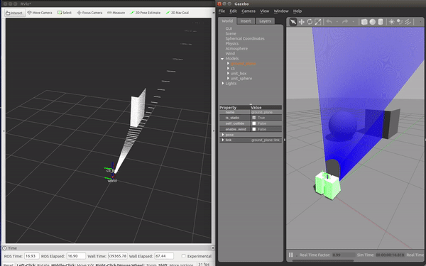

# LEICA SCANSTATION C5 #

This repo contains source code to develop a simulator in Gazebo for Leica Scanstation C5.
This is involved in a ROSIN project.

## Set up ##

* Clone

        mkdir -p ~/catkin_ws/src
        cd ~/catkin_ws/src
        git clone https://github.com/fada-catec/leica_gazebo_simulation.git

* Install dependencies 

* Compile

        cd ~/catkin_ws
        catkin_make
        source devel/setup.bash

## Usage ##

Generate default world and place the device at your convenience

    roslaunch leica_gazebo_simulation c5_system_spawn.launch world:=assembly_line

    roslaunch leica_gazebo_simulation laserscan_to_pointcloud.launch namespace:=c5

    rosrun leica_gazebo_simulation move_c5_pan.py

    rostopic pub /c5/simulator/resolution std_msgs/Float64 "data: 1024.0"

    rostopic pub /c5/simulator/window sensor_msgs/RegionOfInterest "{x_offset: 0, y_offset: 0, height: 1, width: 2, do_rectify: false}"

## Dependencies ##

* ROS [Kinetic](http://wiki.ros.org/kinetic/Installation/Ubuntu)

* Update default Gazebo 7 to Gazebo 9

    -  Uninstall older version of Gazebo
    
            sudo apt-get remove ros-kinetic-gazebo*

            sudo apt-get remove libgazebo*

            sudo apt-get remove gazebo*

    -  Update the repository

            sudo sh -c 'echo "deb http://packages.osrfoundation.org/gazebo/ubuntu-stable `lsb_release -cs` main" > /etc/apt/sources.list.d/gazebo-stable.list'

            wget http://packages.osrfoundation.org/gazebo.key -O - | sudo apt-key add -

            sudo apt-get update

    - Install Gazebo 9

            sudo apt-get install ros-kinetic-gazebo9-*

* PCL:

    1. Boost, Flann, Eigen3

            sudo apt-get install libboost1.58* libflann1.8 libeigen3-dev

    4. VTK

            wget http://www.vtk.org/files/release/7.1/VTK-7.1.0.tar.gz
            tar -xf VTK-7.1.0.tar.gz
            cd VTK-7.1.0 && mkdir build && cd build
            cmake ..
            make                                                                   
            sudo make install

    5. PCL y PCL-ROS

            sudo apt-get install ros-kinetic-pcl-*

            wget https://github.com/PointCloudLibrary/pcl/archive/pcl-1.8.0.tar.gz
            tar -xf pcl-1.8.0.tar.gz
            cd pcl-pcl-1.8.0 && mkdir build && cd build
            cmake ..
            make
            sudo make install

* PYTHON-PCL

        pip3 install python-pcl
        

## Doc ##

        cd ~/catkin_ws/src/leica_gazebo_simulation
        rosdoc_lite .
        google-chrome doc/html/index.html

## Acknowledgement

***
<!-- 
    ROSIN acknowledgement from the ROSIN press kit
    @ https://github.com/rosin-project/press_kit
-->

Supported by ROSIN - ROS-Industrial Quality-Assured Robot Software Components.  
More information: <a href="http://rosin-project.eu">rosin-project.eu</a>

  

This project has received funding from the European Union’s Horizon 2020  
research and innovation programme under grant agreement no. 732287. 

## Help ##
Ines M. Lara - imlara@catec.aero
Other community or team contact
